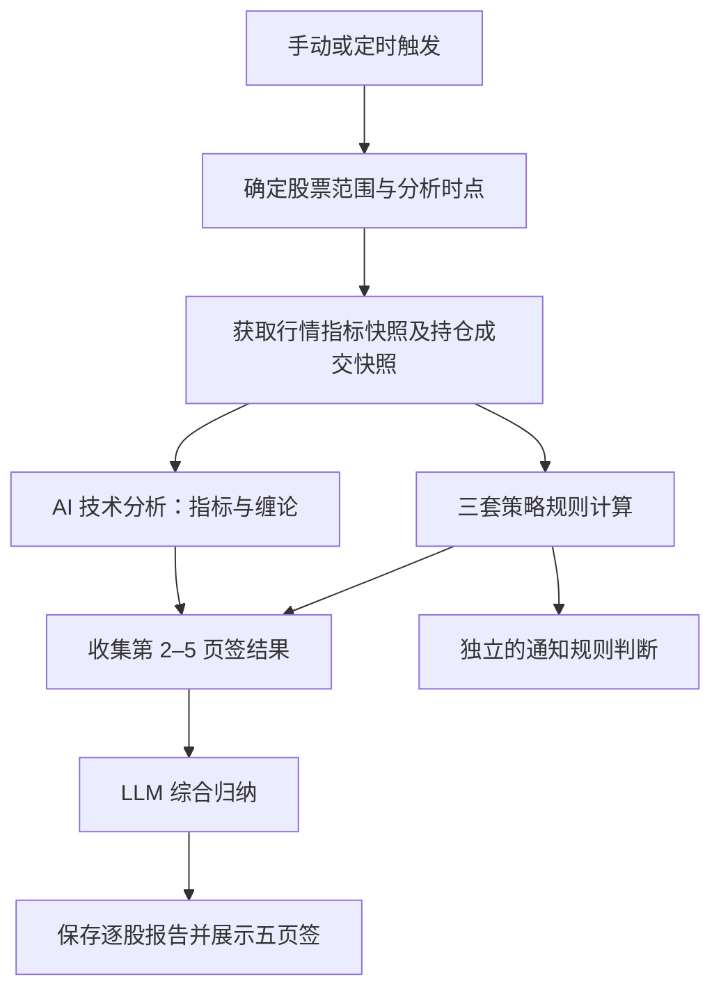

# Quant 系统重构方案

版本：方案 v1 · 2026-10-05（默认选择已获授权并实施；见[实施记录](2026-10-05-system-refactor-implementation.md)）

需求来源：[quant-反馈.txt](../quant-反馈.txt)

依据：当前仓库源码、现有策略研究文档和本次反馈。本次交付为设计方案。

## 1. 建议采用的总体方案

保留 Next.js / React / shadcn 前端、Python 策略计算、现有行情数据源及 PostgreSQL 业务库，在现有系统上分阶段重构。

核心改造是建立统一的“个股分析报告”：一次数据快照，三套确定性策略判断，一份 AI 技术分析，一份 AI 综合结论。手动分析、盘中定时分析、固定时点分析共同调用这条流程；每日筛选和回测复用同一套策略定义。

一级菜单收敛为四个：**个股分析、股票与持仓、策略回测、系统配置**。原“流程说明”放入帮助入口。

优先解决三个基础问题：策略实盘与回测定义不一致、Web 持仓与 Python 风控台账分离、分析任务缺少逐股与逐阶段的结果模型。随后交付页面和调度改造。

## 2. 现状核对与实际差距

| 核对项 | 当前实现 | 重构处理 |
| --- | --- | --- |
| 三套策略 | `macd_zero_axis`、`yearline_pullback`、`macd_divergence`；后两套主要作为研究展示池 | 建立统一策略注册表，分别声明分析、筛选、回测、通知能力 |
| 个股报告 | `results/page.tsx` 展示 AI 解读与研究报告；没有需求中的五份独立结论 | 新增统一五页签报告组件与结构化结果 |
| 自动 AI 解读 | `jobs.ts` 对两个研究池扫描不自动解读；周期监控通常要求 `new_events > 0` | 定时个股分析按执行结果生成报告，与是否出现新推送信号分开 |
| 监控范围 | `monitoring_symbols()` 纳入持仓、自选、MACD 候选池；默认按游标取一批 | 改为明确的分析范围快照，支持三个指标池；完成整轮时可追踪覆盖率 |
| 定时任务 | 只有 `daily_scan` / `monitor_cycle`；后者的固定时间与间隔模式互斥 | 每日筛选一类；个股分析一类，支持间隔与固定时间两种独立计划 |
| 股票池 | 自定义导入与三个指标池均已存在；两种筛选按钮分别设置 `watchlist` / `all_a` | 保留导入，统一为一个全市场筛选操作入口 |
| 用户持仓 | Web 的 `quant.holdings` 是持仓快照；AI 使用这份快照 | 增加逐笔成交账本，明确成本、资金、市值口径 |
| Python 台账 | SQLite 内另有 `position` / `trade_ledger`；通知前风控读取它们 | 分析和风控使用同一个用户持仓上下文，避免两个可独立编辑的事实来源 |
| 旧成交结构 | `trade_ledger` 以“交易日＋股票＋方向”为主键；同日同方向会覆盖记录 | 新账本以成交 ID 标识每笔成交，另设请求幂等键 |
| 年线策略一致性 | 页面池 `strategy/yearline.py` 仅含回踩；`backtest_macd_divergence.py` 的年线对照臂含突破和回踩 | 首版以当前页面池的回踩定义为基线；突破作为独立研究变体保留，不能冒充同一版本 |
| 回测基础 | 已有成交模拟、组合资金分配、费用、收益曲线和策略比较代码 | 提取可调用服务，补齐统一指标口径、任务 API 和页面 |
| 存储分工 | Web 业务数据在 PostgreSQL；Python 候选池、信号、通知队列在 SQLite；行情与报告还有文件缓存 | 首版保留分工，明确各自所有权；本次不同时进行全量数据库合并 |

现有 `docs/README.md` 仍含早期“不做 Web 可视化系统”的描述；本方案以当前代码和新反馈为准，不沿用该旧边界。

## 3. 菜单与页面安排

```text
个股分析
  股票代码输入 / 分析一次 / 监控一次 / 测试通知
  分析记录列表 → 每条个股记录的五页签报告
  最近任务 → 任务详情 / 数据源 / AI 分析

股票与持仓
  [股票池] [我的持仓]                  ← 左右排列的两个页签
  股票池：自定义股票池 / 指标股票池
    自定义：手动添加、文本导入、图片导入
    指标池：日线零轴金叉 / 年线趋势 / 零轴＋底背离
  我的持仓：现有持仓功能＋加仓、减仓、清仓＋成交明细

策略回测
  [个股回测] [全市场回测]
  历史回测任务 → 三策略指标对比 / 曲线 / 成交明细

系统配置
  策略配置
  推送配置
  模型配置
  定时任务
  操作日志
```

系统配置推荐采用可展开的二级菜单，保留子页面独立 URL，便于直接访问。旧路由设置兼容跳转，避免历史链接失效。

页面沿用现有 React、Base UI、shadcn 和 Lucide 组件，不切换到 Vue / Element UI。列表采用紧凑筛选栏、工具栏、表格和分页；列表或详情区域内部滚动。五页签复用现有 Tabs，默认选中综合结论，支持键盘切换、明确的选中状态和小屏横向滚动。

## 4. 个股分析：五页签与统一流程

### 4.1 五个页签的职责

| 顺序 | 页签名称 | 输入 | 应展示的内容 |
| --- | --- | --- | --- |
| 1 | 综合结论 | 第 2–5 页签结果＋同一份持仓、成交上下文 | 当前建议、各方一致与分歧、买卖条件、持仓影响、关键风险、依据时间 |
| 2 | AI 技术分析 | 多周期指标、缠论中枢及买卖点、行情摘要、持仓和交易记录 | LLM 对买点、卖点、趋势和风险的判断；有仓与无仓分别解释 |
| 3 | 日线零轴金叉 | 共用行情快照＋该策略版本参数 | 买入是否触发、缺少哪些条件、退出条件是否触发、关键价位 |
| 4 | 年线趋势 | 共用行情快照＋该策略版本参数 | 当前回踩规则逐项判断、买入条件、退出条件与失效条件 |
| 5 | 零轴＋底背离 | 共用行情快照＋该策略版本参数 | 零轴、已完成区间底背离、放量、年线条件，以及对应退出判断 |

三套策略页由程序执行实际规则，不能用三段不同提示词代替策略计算。正常情况下，一只股票一轮分析需要两次 LLM 调用：AI 技术分析一次、综合归纳一次；并不需要配置五个模型。

每个策略页统一包含：判断状态、买入条件表、卖出条件表、关键价位、风险因素、数据时间、策略与参数版本。条件表显示“实际值 / 要求值 / 是否满足”。没有跨策略统一评分定义时不强行平均分数，以逐项条件解释为主。

### 4.2 计算顺序



- 三策略和 AI 技术分析可在共用快照准备好后独立执行；综合归纳等待四份输入完成或明确失败。
- 分析、行情时间、持仓快照时间分别记录。不同周期允许有各自的截止时间，不能把未收盘日线标为已确认日线信号。
- 盘中展示“已确认 / 盘中预估 / 数据不足 / 数据过期”等状态。收盘确认型策略在盘中主要引用最近已收盘日线，实时价格仅作补充。
- AI 结论必须引用实际输入中的条件与数值。持仓、买入日期或交易记录缺失时显示未知，不能推测成本、持有天数、可卖数量。
- 三策略有分歧时直接展示分歧及条件，不做简单多数投票；风控限制、数据不足和策略禁用状态不能被综合 LLM 改写成“可执行”。
- 原“数据源”入口与现有展示口径保留；新增字段向后兼容。旧报告继续按旧格式展示，标记“历史报告”，不补造缺失的四份结论。

### 4.3 买点、卖点和持仓的关系

买点判断基于当前市场与策略条件；持仓相关的卖出判断还需要成本、成交时间、数量和退出规则。

推荐首版退出规则沿用当前配置的作用范围：零轴金叉与年线回踩使用各自现有固定止损、止盈、超时规则；零轴＋底背离使用当前 `divergence_trend` 规则。现有基线参数包括 8% 止损、30% 固定止盈、40 根持仓超时，但最终必须以冻结的有效配置为准。不能将研究性 ATR 止损建议直接替换为实际退出规则。

无持仓时展示“若建仓，退出条件是什么”，成本相关阈值显示条件表达式或以明确标注的假设入场价计算。已持仓时计算真实持仓下的触发情况；不同买入批次涉及持有天数时保留分笔依据。

综合结论可表达“建仓候选、观察、加仓候选、持有、减仓候选、清仓候选”，同时展示仓位与风险约束。本次新增的持仓操作定义为人工登记实际成交。

### 4.4 报告状态、记录展示与调用成本

建议每页显示 5 条个股分析记录，保留分页历史。一个批次分析 20 只股票就有 20 条逐股报告，另有 1 条父任务；“五条记录”不限制每轮只能分析五只。

每条记录显示股票、来源、分析时间、综合建议和阶段状态，可展开五页签。默认展开一条，其余保留摘要；展开任意一条均能访问全部五页签，避免同时渲染 25 份长报告。

- 先显示三策略结果，LLM 运行期间对应页签显示进度。
- 某个 LLM 阶段失败不丢失策略结果；综合页明确显示哪些输入缺失。
- 允许只重试失败阶段；重试沿用原快照，形成修订版本。使用新行情则生成新分析记录。
- 缓存键至少包括股票、行情截止时间、策略参数版本、持仓与成交版本、模型及提示词版本。
- 定时任务每次都生成执行记录；仅在上述输入完全一致时复用报告内容，标明复用来源。不能因“无新推送信号”跳过整份分析。
- UI 预估本轮股票数和正常 LLM 调用数。20 只完整分析约 40 次逻辑调用，模型降级重试另计；限制并发并记录实际耗时与用量。

## 5. 股票池、持仓与成交记录

### 5.1 自定义池和指标池

自定义股票池继续支持文本、图片、手动输入；复用现有“识别 → 校验代码 → 预览确认”流程。重复代码合并，无法识别的项目单独展示。

指标池由三个策略分别产生，同一只股票可以同时属于多个策略池。保留各池独立的入池时间、最近命中时间、有效期和失效原因。

现有两个按钮的区别只是股票范围：“筛选自选池”仅扫描自定义股票，“全市场筛选”扫描全 A 股。本次页面统一保留一个 **“全市场筛选”** 主按钮，配合“全部三策略 / 某个策略”选择器，默认全部三策略。每日任务固定对三策略执行同一服务。

全市场扫描应显示股票总数、已处理数、命中数、失败数、批次时间。采用有界批次、缓存和断点续跑。各策略完成后发布该策略的新池版本；某策略失败保留其上次成功池并标注时间，不能用半轮结果替换完整结果。

“本轮命中”与按既有 TTL 仍有效的候选分开展示。每日筛选产生的候选结果就是指标池更新来源，不再创建另一个含义相同的股票池。

### 5.2 持仓操作与金额口径

保留持仓列表、账户总资金及已有录入能力，新增“加仓 / 减仓 / 清仓”操作表单，并可展开成交明细。清仓表示登记一笔卖出剩余股份的成交，历史记录仍可查。

输入成交数量、价格、成交时间和费用；页面即时计算金额，服务端重新校验计算。清仓自动带出剩余数量，成交价格仍由实际成交填写。

| 项目 | 建议口径 |
| --- | --- |
| 成交金额 | 数量 × 成交价 |
| 买入现金支出 | 成交金额＋买入费用 |
| 加仓后平均成本 | （原持仓成本总额＋本次成交金额＋买入费用）÷ 新持仓数量 |
| 卖出现金收入 | 成交金额－卖出费用 |
| 已实现盈亏 | 卖出现金收入－本次卖出对应的成本 |
| 减仓后成本 | 加权平均法下剩余每股成本不变；历史盈利单列 |
| 当前市值 / 浮动盈亏 | 数量 × 最新价 / 当前市值－剩余持仓成本 |
| 仓位占比 | 当前市值 ÷ 同口径账户权益；缺少权益时显示未配置 |

金额采用十进制定点计算，最终金额按分舍入；股份用整数。买卖最小数量和余股卖出按板块规则校验，不能把所有 A 股交易一律写死为相同规则。卖出不可超过可卖数量，缺少历史批次时明确可卖数量的可信度。

现有“账户总资金”未必等于实时账户权益。迁移时保留其原含义并标注，不把成本金额直接当市值，也不依据不完整的历史成交推算精确可用现金。

### 5.3 统一持仓事实来源

新成交账本建议由 Web 业务域持有，Python 分析和 TradeGate 通过任务上下文接收同一份持仓与成交快照。避免分析读 PostgreSQL、风控却独立读取旧 SQLite 台账。

成交 ID 与请求幂等键分开：每一笔真实成交都有独立 ID；同一请求重试只记一次。同日同方向多次成交全部保留。记账、成本与持仓投影更新在一个数据库事务内完成，使用行锁或版本校验处理并发。

现有直接修改持仓的功能在新账本下应记录为“持仓校正事件”，不能静默绕过账本。已有持仓转换为期初快照；旧 Python 成交记录先核对来源、重复和覆盖情况，不把缺失的历史成交补造成完整交易史。

发送给 LLM 的上下文包含：该股当前持仓、近期成交明细、较早成交摘要、已实现与浮动盈亏、账户仓位概况、数据完整性标记。建议近期区间和条数可配置，默认近 90 天、最多 50 笔明细；截断时明确提示。

## 6. 定时任务和通知

### 6.1 两类业务、三种触发方式

| 业务 | 触发方式 | 范围与输出 |
| --- | --- | --- |
| 每日策略筛选 | 每个交易日指定时间，建议保留 15:20 默认值 | 全市场分别跑三策略，更新对应指标池；完成后可发一条汇总 |
| 个股定时分析 | 交易时段每 N 分钟 | 对配置范围完成一轮逐股五页签分析 |
| 个股定时分析 | 一个或多个固定时点 | 到点完成一轮逐股五页签分析；可与间隔计划独立启用 |

范围支持：自定义股票池、持仓、各策略指标池、明确股票名单；合并后去重。推荐默认“自定义池＋持仓”，指标池按计划勾选。手动“监控一次”采用页面展示的同一范围，执行一轮完整分析；保留 20 只作为内部处理批大小，不把一批误称为整轮完成。

此默认范围及“每页 5 条”的含义已作为澄清项提出；用户未回复时作为可调整的评审稿默认值，不视为最终确认。

### 6.2 调度的确定行为

- 全部使用 Asia/Shanghai 和交易日历；间隔分析仅在配置的交易时段运行，午休、周末、休市日暂停。
- 固定时点支持收盘后分析，例如 15:20，不能被现有“只在交易时段执行”的判断挡住；节假日默认不执行。
- 每日唯一键使用“计划 ID＋交易日”，内部再拆三策略子任务。分批续跑及失败重试属于同一个逻辑任务；重启不能创建第二轮重复日任务。
- 固定时点使用“计划 ID＋交易日＋时刻”防重；间隔计划使用计划 ID 与时间槽防重，锁和运行状态持久化。
- 一个分析批次冻结股票名单；运行过程中股票池变化进入下一轮，不导致本轮重复或漏股。
- 间隔任务耗时超过间隔时，合并积压的间隔触发，保留一次待运行，记录延后原因；固定时点触发单独记录，不能静默丢弃。
- 首版迟到策略：每日筛选在当天指定时间后恢复时补跑同一逻辑任务；固定分析允许最多 5 分钟迟到窗口，超时标记错过；间隔任务恢复后执行当前轮，不补发大量历史分析。迟到窗口可配置。
- 展示下一次执行时间、实际股票数、当前阶段、覆盖率和上次失败原因。真实交易日历不可用时显示降级状态，避免悄悄把工作日当交易日。

### 6.3 推送边界

报告生成与推送判断独立。生成五页签不意味着每个阶段都发送通知。

- **扫描汇总**：三个策略完成后发送一次合并汇总，列明每池新增、有效数、失败情况；部分失败须明确标注，重试不重复发送相同汇总。
- **交易信号**：首版保留当前生产通知规则和研究池属性，年线及底背离先具备分析展示能力。系统配置按策略展示通知开关，避免接入展示时自动扩大推送范围。
- **分析结论**：可按配置发送完整分析后的摘要或操作建议变化，不按五个页签分别推送；同一轮只发送一次合并摘要。
- **测试通知**：保留现有入口，显示各启用通道的成功 / 失败结果，也可从推送配置页发起。
- **补投队列**：移除个股分析页的手动入口，保留后台 outbox 投递与自动重试，投递结果在操作日志中查看。

需要特别注意：当前代码的日线通知还区分金叉观察预警与评分达标的回落确认，实际行为比反馈里“零轴上方金叉且分数 ≥60”的描述更细。重构应把这两类事件明确展示；如需调整成单一严格门槛，作为独立的通知规则变更处理，不在页面迁移中暗改。

## 7. 策略配置、模型配置还要不要保留

**策略配置必须保留，而且应重组。** 它将是个股分析、扫描、回测共用的参数入口。建议分为：

1. 公共设置：行情周期、指标基础参数、通用过滤与数据完整性要求。
2. 三套策略：各自的入场规则参数、退出规则版本、启用状态。
3. 风控：持仓上限、单股仓位、风险约束。
4. 高级项：旧兼容配置、研究变体；普通页面不展示内部缓存、游标等实现参数。

调度频率和监控股票范围迁至定时任务；推送条件与通道迁至推送配置，减少同一参数在多个页面维护。

每次任务冻结有效参数和版本。修改配置只影响后续任务，历史报告和回测必须能追溯当时的规则。策略定义与参数变化分别记录；研究变体不得覆盖正式策略名称。

模型配置保留现有优先级降级链，增加三个用途：AI 技术分析、综合归纳、图片识别。默认可以共用同一模型，图片识别要求支持视觉；按用途选择降级链。记录实际使用的模型、提示词版本、调用耗时和失败信息，不把 API 密钥写入任务快照。

## 8. 新增回测模块

### 8.1 个股回测与全市场回测

两类回测都选择日期范围、三套策略、参数版本、初始资金、费用与滑点；默认三策略同跑。

个股回测使用同一股票、相同资金和日期，分别运行三个独立账户，展示三条策略曲线以及可选的买入持有基准。全市场回测使用同一历史股票范围、相同初始资金和仓位约束，分别形成三套独立组合。

全市场的年化、回撤和夏普必须来自组合逐日权益曲线，不能对几千只股票的收益或指标简单求平均。候选信号的研究统计可以作为附表，但不能混入实际成交组合的指标。

建议研究默认初始资金 10 万、全市场最多 4 个持仓、单笔资金上限 25%，与已有比较实验便于衔接；个股回测也明确显示仓位设置，可改为满仓。三策略比较必须使用一致的资金约束。默认采用稳定排序并保存排序规则，不能每次随机抽不同股票。

### 8.2 指标定义

反馈中的“最大回测”按“最大回撤”理解。

| 指标 | 首版计算口径 |
| --- | --- |
| 年化收益率 | `(期末权益 / 期初权益)^(252 / 区间交易日收益样本数) - 1`；采用完整选定区间，初始权益作为首个收益基点 |
| 最大回撤 | 每个交易日权益相对此前峰值的最大跌幅，包含初始权益基点 |
| 夏普比率 | `sqrt(252) × mean(日超额收益) / std(日超额收益)`；采用样本标准差（ddof=1），首版日无风险收益默认 0 并显式记录 |
| 盈亏比 | 已平仓交易的平均净盈利金额 / 平均净亏损金额绝对值；费用计入净盈亏 |
| 胜率 | 净盈利的已平仓交易数 / 全部已平仓交易数；零盈亏计入分母 |
| 收益曲线 | 完整交易日历上的账户净值与累计收益，包含空仓日期 |

无成交、无亏损、日收益零波动等情况返回可解释的 `N/A`，不伪造 0 或无穷大。可追加总收益、成交次数、费用、资金利用率和基准表现。

历史研究脚本中的 `avg_win_loss_ratio` 基于百分比收益统计，与本方案的净金额盈亏比并非必然相同；如保留历史口径，必须标为“单笔收益率盈亏比”。盈亏比也不能与“总盈利 / 总亏损”的盈亏因子 PF 混用。

### 8.3 复用与必补的准确性要求

优先提取 `backtest_winrate.py` 的成交执行、资金约束和权益曲线能力，复用 `backtest_macd_divergence.py` 的策略比较经验。旧 `backtest/` 报告与成本模块可按适配程度利用，不并行维护第二套同名规则。

必须补齐以下约束后再作为正式回测页面输出：

- 三策略入场和退出计算调用与个股分析相同的版本化规则；先解决年线回踩与突破混用的问题。
- 历史每一步只使用当时及以前的数据。收盘信号按下一可成交时点执行；持仓风险触发按统一成交规则模拟，日内高低价先后不明时明确采用保守假设。
- 缠论等存在右侧确认的结构记录确认时间，不能把未来确认的结构回填为历史时点已知。
- 覆盖 T+1、涨跌停、停牌、交易单位、手续费、印花税和滑点；税费使用适用日期的规则，现有固定印花税配置需校核，不能直接推广到所有历史区间。
- 指标采用一致复权口径；复权价格、真实持仓成本、成交资金、分红送转之间建立明确换算，避免把当前复权价与历史实际成本直接比较。
- 历史股票范围按当时上市、退市状态选取；缺少退市样本或历史 ST 状态时标注覆盖偏差。不能把今天的自选池或候选池当成历史全市场。
- 年线策略预热至少覆盖 MA250 与斜率窗口，预热数据不计入回测收益区间。历史不足的股票给出排除原因。
- 现有组合曲线主要按候选及持仓覆盖日期组织；正式年化与夏普要补齐用户选择区间的全部交易日，包括首笔成交前和最后成交后的空仓日期。
- 区间末尾未平仓股票按收盘价计入权益，单列未实现盈亏；不虚构强制平仓成交，不计入已平仓胜率。
- 保存数据快照标识、股票范围清单、代码版本、参数、排序及费用设置，同样输入重复运行结果可复现。

### 8.4 本地运行与长任务

遵守本项目双环境规范：所有回测和验证由本地研究执行器运行，使用本地 PostgreSQL 与本地行情缓存。生产调度器不执行回测，不将回测成交写入真实持仓或通知链路。

首版回测入口在本地开发 / 研究环境启用。生产界面若保留该菜单，应明确显示“请在本地研究环境运行”；生产远程提交到本地研究执行器属于后续独立能力，不能通过复用生产进程来代替隔离。

全市场回测使用后台任务，显示数据准备、策略计算、组合模拟、指标生成进度；支持失败重试和断点继续，页面刷新不影响执行。首次大范围运行前先测本地数据覆盖率和小样本耗时，不预先承诺全市场分钟级完成。

## 9. 技术实现边界与数据模型

### 9.1 服务拆分

保持模块化单体和现有 Python bridge 接口，逐步把长任务从 Web 请求生命周期移到可独立重启的任务执行器。首版可复用现有进程方式，但新增分析和全市场回测必须有持久化状态与恢复机制；回测执行器始终隔离在本地研究环境。

| 模块 | 职责 |
| --- | --- |
| Strategy Registry | 注册三策略 ID、入场 / 退出规则、版本、参数定义及能力 |
| Analysis Service | 创建逐股分析，冻结快照，编排策略计算、LLM 分析和归纳 |
| Scan Service | 对给定全市场范围运行所选策略，管理分批状态和候选池发布 |
| Portfolio Context Service | 提供同口径持仓、成交历史、资金与完整性快照 |
| Schedule Service | 日历、计划、时间槽、幂等触发、错过与延后记录 |
| Notification Service | 根据分析 / 扫描结果形成通知，沿用 outbox 与去重 |
| Backtest Service | 本地历史回放、组合执行、指标与报告生成 |

策略核心只计算结果，不直接记账、推送或修改股票池；这些副作用由对应服务负责。这样才能把同一规则用于分析和历史回放。

### 9.2 建议新增 / 扩展的数据对象

以下为逻辑模型，实施时通过受控 schema 版本升级落地，本文不提供直接执行的 SQL。

| 对象 | 主要内容 |
| --- | --- |
| 分析批次 | 来源、计划、冻结股票名单、行情截止、配置版本、状态与进度 |
| 个股分析记录 | 批次 ID、股票、数据与持仓快照引用、五页签状态、结果版本 |
| 策略分析结果 | 策略 ID / 版本、参数快照、买卖判断、逐项证据、参考价与错误 |
| LLM 阶段记录 | 技术分析 / 综合归纳、模型与提示词版本、输入引用、输出、用量、失败与重试 |
| 成交记录 | 成交 ID、幂等键、股票、方向、数量、价格、费用、时间、来源、关联持仓版本 |
| 持仓快照 / 校正事件 | 数量、成本、期初来源、可卖信息、完整性、版本 |
| 调度计划 / 执行记录 | 业务类型、触发模式、范围、时区、时间槽、父任务、迟到与执行状态 |
| 扫描批次 | 三策略子任务、范围版本、覆盖率、当前发布状态；候选明细首版仍由 Python 存储负责 |
| 回测任务 / 结果 | 本地环境标记、数据与策略版本、运行参数、逐日权益、成交、排除原因和指标 |

任务状态建议统一支持 `pending / running / success / partial_failed / failed`，阶段状态单独保存。旧 `jobs` 继续承载最近任务与追踪 ID，新增子记录支持逐股、逐策略定位。新旧报告格式通过 `schema_version` 区分。

大行情快照和完整回测曲线可以保留为不可变文件，数据库保存引用及摘要；文件归档随任务元数据一起校验，避免报告记录存在而文件丢失。新旧任务所有权由特性开关控制，同一计划不能由两个执行器同时运行。

### 9.3 主要改造落点

- 前端：`src/components/nav-links.tsx`，`src/app/results/page.tsx`，`src/components/stock-analysis-report.tsx`，`src/app/pool/page.tsx`，`src/app/holdings/page.tsx`，配置子页面与新增回测页面。
- Web 服务：`src/lib/jobs.ts`、`scheduler.ts`、`holdings-context.ts`、`llm.ts`、`types.ts`、`db.ts`，以及相应分析、成交、扫描和回测 API。
- Python：`signal_system/web_bridge.py`、`monitor/service.py`、`strategy/macd.py`、`strategy/yearline.py`、`strategy/macd_divergence.py`；提取策略协议和独立退出规则。
- 复用基础：`signal_system/trading/positions.py` 中的风控思想，现有候选池 / outbox，两个主回测脚本与现有测试样例。

上面 Web 路径均相对 `quant-python/web/`；Python 路径均相对 `quant-python/`。

## 10. 实施顺序与验收

| 阶段 | 主要交付 | 验收标准 | 粗估工作量 |
| --- | --- | --- | --- |
| P0：冻结口径 | 三策略定义、退出规则、统一结果协议、回测样本基线 | 明确年线当前版本；同一历史时点在分析与回放中得到一致的策略判断 | 2–3 人日 |
| P1：持仓上下文 | 逐笔成交设计与服务、期初快照、统一风控上下文 | 同日多次成交不覆盖；重试不重复记账；并发减仓不超卖；AI 和风控使用同一快照 | 3–5 人日 |
| P2：完整个股分析 | 两阶段 LLM＋三策略＋五页签＋历史记录 | 任意个股有五份可追溯结果；一阶段失败可局部重试；数据源入口和旧报告可读 | 4–5 人日 |
| P3：扫描和调度 | 三策略全市场扫描、两种分析计划、任务恢复 | 每日逻辑任务只建一次；三池分别更新；无新信号仍有分析记录；固定收盘时点可运行 | 3–4 人日 |
| P4：页面整合 | 四个一级菜单、股票与持仓页、配置分组 | 反馈中的入口均有明确归属；保留测试通知；一个全市场筛选入口；旧链接可到达 | 2–3 人日 |
| P5：本地回测 | 个股 / 全市场任务、三策略指标与收益曲线 | 无前视、完整日历、费用及成交约束通过样例；指标可手工复核；回测不接生产 | 5–7 人日 |
| P6：联调上线准备 | 新旧兼容、恢复与幂等验证、运行说明 | 中断恢复不漏股、不重复触发；数据与版本可追溯；完成环境隔离检查 | 2–3 人日 |

合计粗估 **21–30 人日**，为单人等效工作量，不是工期承诺；实际主要取决于旧持仓可追溯程度、三策略统一难度、历史行情覆盖及全市场回测性能。P1 与 P2 可在协议冻结后拆开实施，但接入真实持仓分析前必须完成上下文统一。

建议以“能正确解释一只股票的五页签”为第一项可见交付，再扩展定时任务和股票池，最后接全市场回测。前期不同时更换数据源、前端技术栈和全部存储方案。

重点验证使用现有测试框架与本地夹具，覆盖规则一致性、未来数据截断、持仓金额、幂等、防超卖、交易日与固定时点、跨进程恢复、LLM 局部失败、回测指标。文档评审阶段仅核对源码，不需要启动服务或运行有业务写入的流程。

数据库相关开发 / 集成验证按 quant 专用规范使用本地 Docker PostgreSQL `quant-pg`（`127.0.0.1:5432`）；Python 本地 SQLite 存储测试通过 fixtures / conftest 隔离。生产快照仅下行。Schema 变更同步修改 `web/db/schema.sql` 与 `web/src/lib/db.ts` 的版本，通过本地 `db:setup` 验证，再按既有受控发布流程同步生产并运行 `db:verify`。回测文件和本地测试数据不上传为生产业务数据。

## 11. 反馈逐项对应

| 反馈 | 方案处理 |
| --- | --- |
| 1.1 个股五页签、携带持仓交易记录 | 第 4 节统一报告，第 5 节持仓与成交上下文 |
| 1.2 日线扫描标记 X | 从个股页移除入口；扫描能力归入指标池和每日任务 |
| 1.3 监控一次修改 | 对页面明确选择的范围执行完整一轮五页签分析 |
| 1.4 补投队列删除 | 移除页面手动入口；后台自动重试保留 |
| 1.5 测试通知保留 | 个股页保留，配置页也能触发 |
| 1.6 最近任务与数据源 | 最近任务保留；数据源展示保持兼容；查看 AI 分析进入五页签 |
| 2 策略配置是否有用 | 保留并升级为分析、筛选、回测的共用配置与版本入口 |
| 3 推送配置 | 并入系统配置，区分扫描汇总、交易信号、分析摘要 |
| 4 每日 / 间隔 / 固定时点 | 两类业务、三种触发方式；间隔与固定计划可独立启用 |
| 5 配置模块合并 | 系统配置下五个子菜单，包括操作日志 |
| 6 股票池与持仓 | 合并为一个一级菜单、两个左右页签 |
| 6.1 文本与图片导入 | 复用现有识别、预览、确认流程 |
| 6.2 三策略指标池与单一筛选按钮 | 独立三池，一个全市场筛选按钮＋策略范围选择 |
| 6.3 加仓 / 减仓 / 清仓与金额 | 逐笔登记、即时计算、事务更新、完整成交历史 |
| 7.1 个股回测 | 本地同股三策略独立账户，五项指标与曲线 |
| 7.2 全市场回测 | 本地三策略独立组合，统一资金、范围与成交口径 |

## 12. 评审稿的默认选择

以下为本稿推荐值，可在实施前直接调整：

1. 五条记录按“每页五条个股报告、历史可翻页”实现。
2. 定时分析默认自定义池＋持仓，三个指标池可选；内部按 20 只分批但完成整个冻结范围。
3. 三策略采用当前代码定义；年线首版仅回踩，突破保留为具名研究变体。
4. 退出规则保持现有按信号类型区分的基线；策略算法优化单独版本化。
5. 新增研究策略的分析展示不自动改变当前通知启用范围。
6. 持仓采用含买入费用的加权平均成本法，成交操作登记真实成交，旧数据不足处保留未知标记。
7. 回测只在本地研究环境开放执行，结果与真实账户业务分离。

本文件保留方案阶段的设计与默认选择。随后用户已授权实施，实际改动、本地验证及尚未执行的生产操作以[实施记录](2026-10-05-system-refactor-implementation.md)为准。
